# Task Habit Tracker

### Authors

Ryan Don: 100824494

David Garcia: 100820537

## App Description

The Task Habit Tracker is an app we made to stay on top of recurring tasks you may want to do throughout the week. Say you want to go to the gym on Monday, Wednesday, and Friday.
Our app will neatly lay out all the tasks you have directly in your upcoming week so you don't get overwhelmed, while also encouraging you with a streak system. Not only this, but it also provides you with the option to sync your tasks to Google Calendar so you can easily reference what you have coming up during the week!

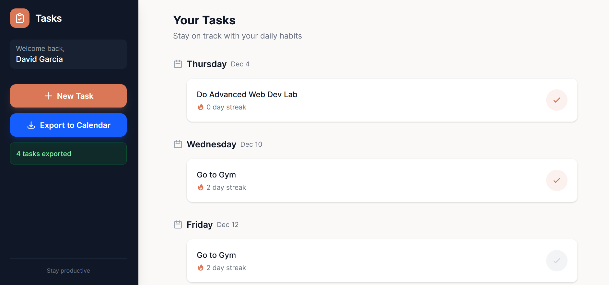

## How to Run

There are two main ways you can use our app. The first is to visit the link we deployed on Railway (more on that later). Or to run it yourself with docker.

### Deployed Link

To access the deployed link go to [https://advanced-web-dev-2025-fall-production.up.railway.app/](https://advanced-web-dev-2025-fall-production.up.railway.app/)

### Docker Instructions

The second way to run the app is to use docker. The repository has a `.env.example` inside of `backend/` provided which you need to populate. Once
you populate it you ***MUST RENAME*** it to `.env`

**IMPORTANT:** If you are a TA or the Prof of this class, the exact .env was provided in the COMMENTS that was submitted in canvas with all the keys required.
feel free to copy paste it into `/backend/.env.example` and then rename the file to `.env`

If you have all the proper variables simply run the following command.

```bash
docker-compose --env-file .env.docker up --build
```

Then you should be able to access the project on `http://localhost:5000`!


### Running Tests

Our integration and E2E tests are both located inside `/backend/tests/`

Before running the tests make sure you run the following if you haven't already:

```bash
cd backend/
python3 -m venv venv
source venv/bin/activate
pip install -r requirements.txt
```

Then cd into the `tests/` directory, and run `pytest` to run all the tests. Integration and E2E.

To run just the integration tests, or the end-to-end tests, run their respective commands:

```Shell
# Integration Tests
pytest test_auth_endpoints.py
pytest test_task_endpoints.py
pytest test_user_endpoints.py
```

```Shell
# End-to-end Tests
pytest test_e2e.py
```

## Project Structure

This project follows a Monolithic MVC architecture. The **Next.js** frontend does not compute any authentication or busines logic, that is all handled on the **Flask** backend.

Further to this, the backend is split into four main sections.

- Controllers
    - Contains the main endpoints split by auth, task, and user
- Services
    - Contains the main business logic for the endpoints and database read/writes
- Models
    - Contains the definitions for all the database tables. This is used to define how the database will be created
- Schemas
    - Uses marshmallow to easily deserialize the models for code readability

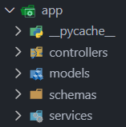

### Docker Structure

Initially, the docker structure was setup such that we had three containers.

1. Frontend Container
2. Backend Container
3. Database Container

This setup worked well locally, but we began running into issues when trying do deploy. 

At first, we tried deploying the frontend on Vercel and the backend on Railway, but kept running into CORS issues, even though we explicitly allowed the relevant endpoints.
We then tried moving the frontend and backend as two seperate services on Railway, but that also failed as they still had seperate origins. After hours and hours of ripping our hair out, we
finally realized that the issue was exclusive to Firefox. The CORS policy yielded no issues on Chrome or Edge, but it seems Firefox has a more strict policy.

Given this we decided to change the way our docker was setup to just have two containers.

1. Webapp container
2. Backend container

This also required some changes in the logic in the backend as now we had to setup the dockerfile such that it would first `npm run build` the frontend javascript bundle,
and later copy it into the backend where the backend then serves the frontend files. This solved all our CORS issues.

## Database volume

When running docker compose locally, it creates a `MySQL` container that stores your data and persists it to a volume. You should notice that by default, the .env file for the backend has 
`FLASK_ENV="production"`. This is to help docker identify that it is meant to use the relevant `MySQL` connections in the same .env file. This is important, because for testing it uses a `SQLite` database in memory.

## Deployment Info

In the previous section I went into detail about the struggles we had with deployment. Here I will go into more detail regarding how our deployment process works.

### CI 
Each feature we make is done on a branch off of main. When we are done with the feature we make a pull request into main. 
This initializes the CI pipeline that runs all of our tests to make sure our code is working as expected. 
This allows us to see if there are any problems **before** merging into main. 

### CD
After making sure that the tests all ran successfully, we are then able to merge into main. Once the branch has been merged the testing pipeline is run one more time with the merged codebase
to make sure everything works as expected. If this succeeds, Railway then automatically detects that the pipeline was a success and begins the deployment process.

There are three main parts of our app that we'll be focusing on for deployment. Our frontend, backend, and main dockerfile.

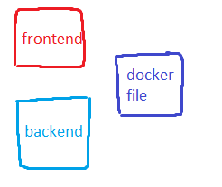

When we're done working on a feature in a branch, we make a pull request into the main branch. Tests are run in github before the code gets merged. If it all looks good, the code gets merged.


Once the code is merged into main, it gets tested one more time to make sure that it works nicely along the rest of the main code.

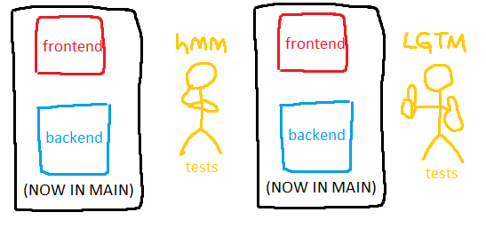

If the tests pass in MAIN, it all gets sent up to Railway, the spot where we host our app.

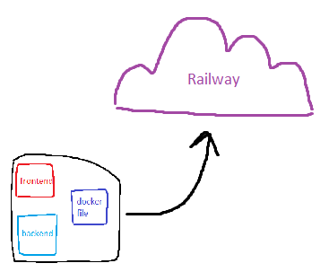

The dockerfile then gets all the environment variables from Railway, and all the backend dependencies are installed.

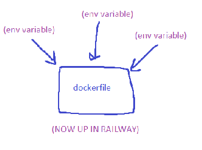

The frontend is compiled with the dockerfile, and broken down into raw, servable compiled html js and css files. These files are then copied into the backend directory `/backend/static/frontend`. Once the files are in there, the backend is able to serve them on the same url as the backend, with different endpoints.

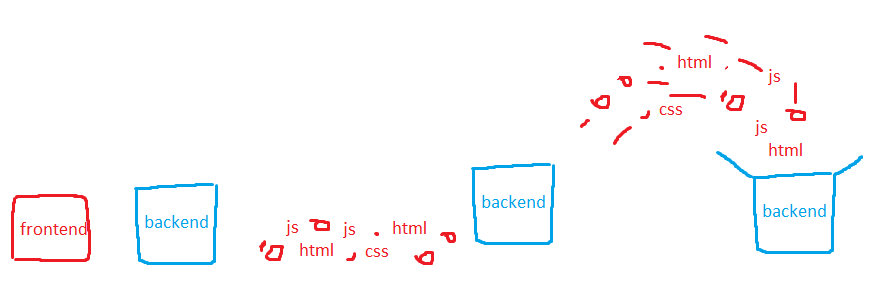

The final result, is our frontend files inside our backend, inside railway, hosted at this endpoint: 

https://advanced-web-dev-2025-fall-production.up.railway.app/

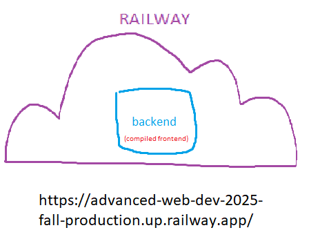

Easy as that!


### Railway
The way we have railway setup is that we have two services.

1. Webapp service
2. Database service

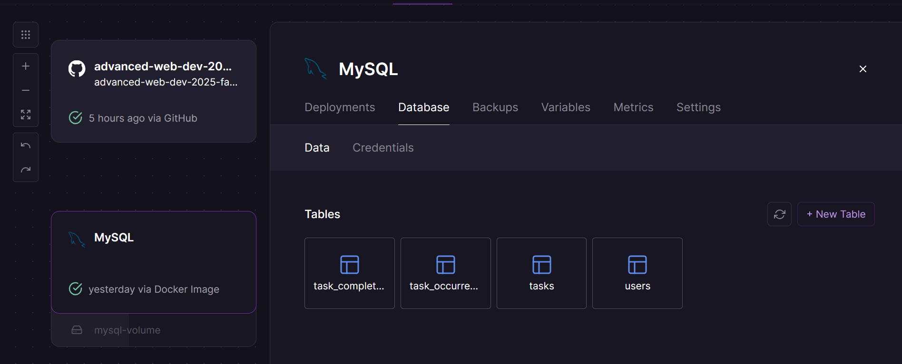
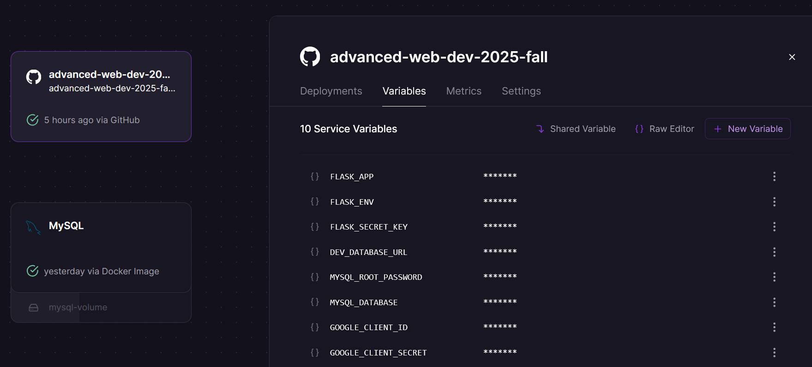

The nice thing about Railway is that it automatically detects the Dockerfile and uses that to deploy the container for the service. The only issue is that it does not have support for docker-compose.
We managed to solve this issue by making an instance of a mysql database and then putting the relevant credentials in the environment as you can see in the images above.

## Database Schema

Below is the schema diagram for our database as taken with dbeaver:

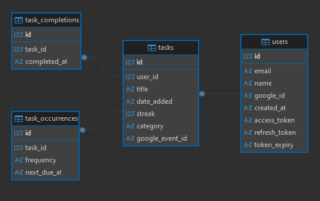

Here is a brief description of what purpose each table serves:

- users
    - Contains data on users and securely stores Google Oauth access and refresh tokens.
- tasks 
    - Contains the general task information like name, streak, and google calendar data for syncing.
- task_occurrences
    - This table was meant to clearly distinguish between tasks that are meant to be completed on more than one day in the week.
- task_completions
    - This table is meant to keep track of every single task that has been completed for metrics and debugging.

## External API usage

Independently of having already used Google Oauth, we also set up syncing with Google Calendar so that you can get notifications in your calendar for tasks you would like to complete.
If you create a task and click the export button, it will update on your calendar. Likewise if you delete it and export again, it will sync and remove the data.

Below is an image of what this looks like:
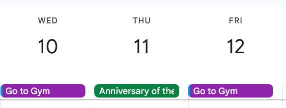

## Pagespeed results

Lastly, here is our page speed analysis for our page! Not too bad if you ask me...

https://pagespeed.web.dev/analysis/https-advanced-web-dev-2025-fall-production-up-railway-app/nw68zoiam4?form_factor=desktop

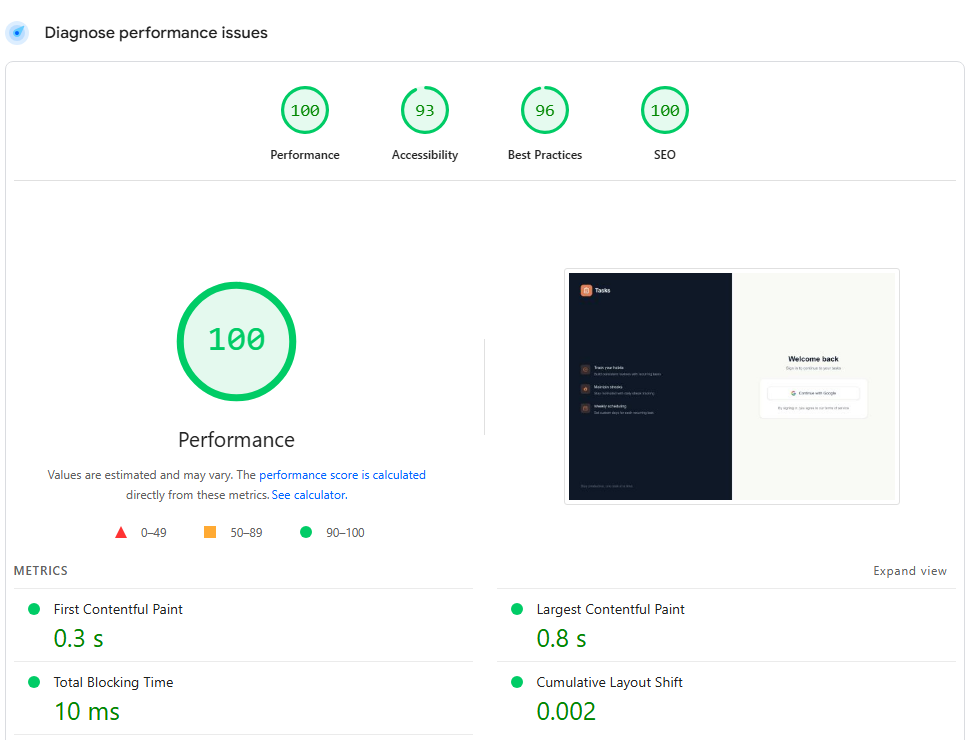

## Extra images
If you would like to look at some extra screenshots not in this README, feel free to look inside `documentation_screenshots`. 

Thanks for reading all this and we hope you enjoy our app!!!